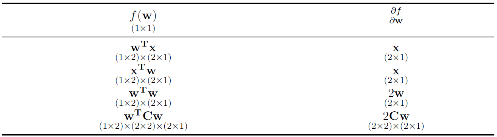

# OLS

## SLR

We define our column vector of parameters $\mathbf{w}$
($\boldsymbol{\beta}$ in econometrics):

$$\mathbf{w} = \begin{bmatrix}
           w_{0} \\
           w_{1} 
         \end{bmatrix}$$

A single observation $\mathbf{x_n}$ is: $$
  \mathbf{x_n} =
  \begin{bmatrix}
          1 \\
          x_{n} 
  \end{bmatrix}
$$ And thus the value predicted by the model can be written as:

$$
  f(x_n; w_0, w_1) = 
  w_0 + w_1x_n = 
  \begin{bmatrix}
  w_0 & w_1
  \end{bmatrix}
  \begin{bmatrix}
  1 \\ x_1
  \end{bmatrix} = 
  \mathbf{w}^T\mathbf{x_n}
$$ The matrix representing all the input data $\mathbf{X}$ and the
column vector of outcomes $\mathbf{t}$ ($\mathbf{y}$ in econometrics)
are:

$$
\mathbf{X} = 
\begin{bmatrix}
x_{1}^T \\
x_{2}^T \\
\vdots \\
x_{N}^T
\end{bmatrix}
= \begin{bmatrix}
1 & x_{1} \\
1 & x_{2} \\
\vdots & \vdots\\
1 & x_{N}
\end{bmatrix}
$$

$$
\mathbf{t} = 
\begin{bmatrix}
t_{1} \\
t_{2} \\
\vdots \\
t_{N}
\end{bmatrix}
$$

The loss function $\mathcal{L}$ becomes $$
\mathcal{L} = 
\frac{1}{N}(\mathbf{t} -\mathbf{X})^T(\mathbf{t} -\mathbf{X})
$$

The column vector of values predicted by the function $f(x_n; w_0, w_1)$
are:

$$\mathbf{Xw} = 
\begin{bmatrix}
1 & x_{1} \\
1 & x_{2} \\
\vdots & \vdots \\
1 & x_{N}
\end{bmatrix}
\times
\begin{bmatrix}
  w_0 \\ w_1
\end{bmatrix} =
\begin{bmatrix}
  w_0 & w_1x_1 \\
  w_0 & w_1x_2 \\
  \vdots & \vdots \\
  w_0 & w_1x_N 
 \end{bmatrix}
$$

$$
\underset{(N \times 2)}{\mathbf{X}} \times \underset{(2 \times 1)}{\mathbf{w}} =
    \underset{(N \times 1)}{\mathbf{Xw}}
$$ The column vector of residual is

$$
\mathbf{t} - \mathbf{Xw} = 
\begin{bmatrix}
  t_1 - w_0 + w_1x_1 \\
  t_2 - w_0 + w_1x_2 \\
  \vdots \\
  t_N - w_0 + w_1x_N 
 \end{bmatrix}
$$

The sum of squared errors can be expressed as:
$$\sum_{n=1}^{N} (t_n - (w_0 + w_1x_1))^2 \\$$

$$ =
\begin{bmatrix}
  t_1 - (w_0 + w_1x_1) &
  t_2 - (w_0 + w_1x_2) &
  ... &
  t_N - (w_0 + w_1x_N )
\end{bmatrix} 
 \times
\begin{bmatrix}
  t_1 - (w_0 + w_1x_1) & \\
  t_2 - (w_0 + w_1x_2) & \\
  \vdots \\
  t_N - (w_0 + w_1x_N )
\end{bmatrix} \\
= (\mathbf{t} - \mathbf{Xw})^T(\mathbf{t} - \mathbf{Xw})$$

We can now write our loss function compactly with matrix notation, which
produces a scalar $(1 \times 1)$ value:

$$
\underset{(1 \times 1)}{\frac{1}{N}}
\underset{(1 \times N)}{(\mathbf{t} - \mathbf{Xw})^T}
\underset{(N \times 1)}{(\mathbf{t} - \mathbf{Xw})}
= 
\underset{(1 \times 1)}{\mathcal{L}}
$$ We can expand the sum of squared errors as follows:

$$
(\mathbf{t} - \mathbf{Xw})^T(\mathbf{t} - \mathbf{Xw})$$

$$= (\mathbf{t}^T - (\mathbf{Xw})^T)(\mathbf{t} - \mathbf{Xw})$$

$$=(\mathbf{t}^T - (\mathbf{w}^T \mathbf{X}^T))(\mathbf{t} - \mathbf{Xw})$$

```{=tex}
\begin{equation}
=\underset{(1 \times 1)}{\mathbf{t}^T\mathbf{t}} -
\underset{(1 \times N)}{\mathbf{t}^T}
\underset{(N \times 2)}{\mathbf{X}}
\underset{(2 \times 1)}{\mathbf{w}} -
\underset{(1 \times 2)}{\mathbf{w}^T}
\underset{(2 \times N)}{\mathbf{X}^T}
\underset{(N \times 1)}{\mathbf{t}} +
\underset{(1 \times 2)}{\mathbf{w}^T}
\underset{(2 \times N)}{\mathbf{X}^T}
\underset{(N \times 2)}{\mathbf{X}}
\underset{(2 \times 1)}{\mathbf{w}}
\end{equation}
```
Note the following:

-   each of the term becomes $1 \times 1$

-   the terms $\mathbf{t}^T \mathbf{Xw}$ and
    $\mathbf{w}^T \mathbf{X}^T\mathbf{t}$ are transposes of each other
    and are scalars. So they are the same value and can be combined.

So, sum of squared residuals can be written as
$$\mathbf{t}^T\mathbf{t} - 2\mathbf{w}^T\mathbf{X}^T\mathbf{t} +
\mathbf{w}^T\mathbf{X}^T\mathbf{X}\mathbf{w}$$

Hence, the loss function becomes:

$$\mathcal{L} = \frac{1}{N}\mathbf{t}^T\mathbf{t} - 2\mathbf{w}^T\mathbf{X}^T\mathbf{t} +
\mathbf{w}^T\mathbf{X}^T\mathbf{X}\mathbf{w}$$

Now that we have defined our loss function in matrix notation, we still
want to find the value of w that will minimize the loss. Like before,
this involves taking the derivative (now with respect to the vector
$\mathbf{w}$), setting the derivative equal to 0, and then solving for
$\mathbf{w}$. Thus, we must delve into doing vector Calculus.

## Review: Derivatives

Lets say we have a function of one variable that produces a scalar
output (real-valued input is mapped to real-valued output):

$$
f:
\mathbb{R} 
\rightarrow 
\mathbb{R}
$$ The derivative of this function tells us how the function changes
with respect to that variable. The derivative is:

$$
f^{\prime}(x) = 
\lim_{h\to 0} 
\frac{f(x + h) - f(x)}{h}
$$

Which can be rearranged to say that the derivative at a $f^{\prime}(x)$
satisfies the following:

$$
\lim_{h\to 0} 
\frac{f(x + h) - f(x) - f^{\prime}(x)h}
{h} 
= 0
$$

**Gradient**

Let's say we have a function of a vector that produces a scalar output
(n-dimensional real-valued input is mapped to one real-valued output):

$$
f:
\mathbb{R}^{n} 
\rightarrow 
\mathbb{R}
$$

The gradient $\nabla f(x)$ is the multidimensional derivative and it
tells us how the function changes with respect to each component in the
vector. It satisfies the following equation:

$$
\lim_{\| h \|\to 0} 
\frac{\|f(x + h) - f(x) - f^{\prime}(x)h\|}
{\| h \|}
= 0
$$

Again, we have a function of a vector that produces a scalar
$f:\mathbb{R}^{n} \rightarrow\mathbb{R}$. The input to the function is a
vector:

$$\mathbf{w} = (w_1, w_2, ..., w_n)^T$$

The gradient of the function with respect to $\mathbf{w}$ at
$\mathbf{w}$ is itself a vector:

$$
\nabla f(\mathbf{w}) =
\frac{\partial{f}}{\partial{\mathbf{w}}} =
(
\frac{\partial{f}}{\partial{w_1}},
\frac{\partial{f}}{\partial{w_2}}, ...,
\frac{\partial{f}}{\partial{w_n}}
)^T =
\begin{bmatrix}
  \frac{\partial{f}}{\partial{w_1}} \\
  \frac{\partial{f}}{\partial{w_2}} \\
  \vdots \\
  \frac{\partial{f}}{\partial{w_n}}
 \end{bmatrix}
$$ Like the derivative, the gradient represents the slope of the tangent
of the graph of the function. More precisely, the gradient points in the
direction of the greatest rate of increase of the function, and its
magnitude is the slope of the graph in that direction.

The gradient will always have the same dimensions as the input vector.
In the following examples, $\mathbf{w}$ and $\mathbf{w}$ are 2 x 1
matrices.

```{r, echo = FALSE}

```

## Back to SLR

Earlier, we found the total OLS regression loss function to be:

$$\mathcal{L} = \frac{1}{N}\mathbf{t}^T\mathbf{t} - 2\mathbf{w}^T\mathbf{X}^T\mathbf{t} +
\mathbf{w}^T\mathbf{X}^T\mathbf{X}\mathbf{w}$$

We will take the derivative of the loss with respect to the vector $\mathbf{w}$, set the derivative equal to
the $\mathbf{0}$ vector, and then solve for $\mathbf{w}$.

If $\mathbf{w}$ is a $2 \times 1$ vector, then $\nabla{f}$ must also be $2 \times 1$.

Now note that $\underset{(1 \times 2)}{\mathbf{w}^T}\underset{(2 \times N)}{\mathbf{X}^T}\underset{(N \times 1)}{\mathbf{t}}$ could be treated as $\underset{(1 \times 2)}{\mathbf{w}^T}\underset{(2 \times 1)}{\mathbf{x}}$

$$
\frac{\partial f}{\partial\mathbf{w}} =
0 - 
\frac{N}{2}X^T\mathbf{t} +
\frac{N}{2}X^TX\mathbf{w}
$$
